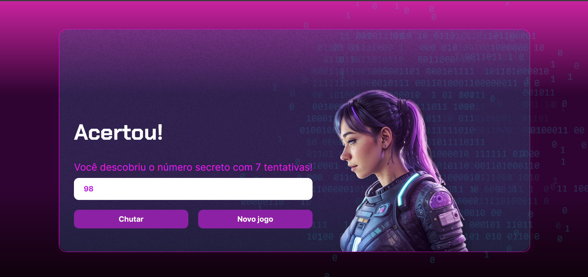

# Jogo do Número Secreto

Este projeto consiste em um jogo simples de adivinhação de números desenvolvido utilizando HTML, CSS e JavaScript. O computador escolhe um número aleatório entre 1 e 100, e o jogador tenta adivinhar qual é esse número.

## Como Jogar

### Requisitos:
- Navegador web moderno com suporte a JavaScript.

### Instruções:
1. Abra o arquivo `index.html` em seu navegador.
2. Digite um número no campo de entrada.
3. Clique no botão "Chutar" para verificar se o número que você digitou é igual ao número secreto escolhido pelo computador.
4. O jogo informará se o número que você digitou é muito alto, muito baixo ou se você acertou o número secreto.
5. Você pode reiniciar o jogo clicando no botão "Novo jogo".

## Demonstração

[Vídeo do jogo em ação]([https://link-para-video.com](img/video_gif/jogo_gif.gif)

## Recursos

- Implementação utilizando HTML para a estrutura da página.
- Estilização da interface feita com CSS para uma experiência visual agradável.
- Lógica do jogo desenvolvida em JavaScript para interação dinâmica e validação das entradas do usuário.

## Estrutura de Arquivos

- `index.html`: Estrutura básica do jogo e elementos HTML.
- `style.css`: Estilos e layout do jogo.
- `app.js`: Lógica do jogo e manipulação do DOM.

 ## Tecnologias Utilizadas

- HTML
- CSS
- JavaScript
- [ResponsiveVoice](https://responsivevoice.org/) para narração

## Contribuição

Contribuições são bem-vindas! Se você quiser melhorar este jogo, sinta-se à vontade para enviar um pull request.

## Autor

Desenvolvido por Gabriele.

## Licença

Este projeto está licenciado sob a Licença MIT - veja o arquivo LICENSE para mais detalhes.
